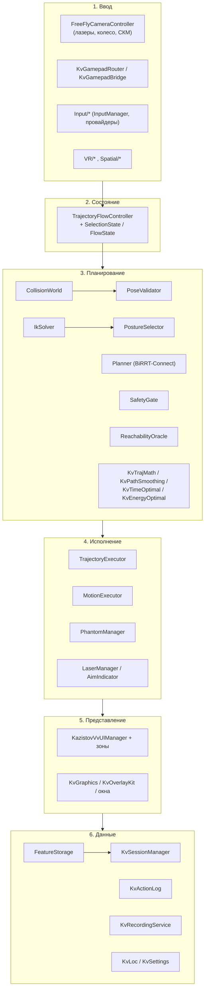
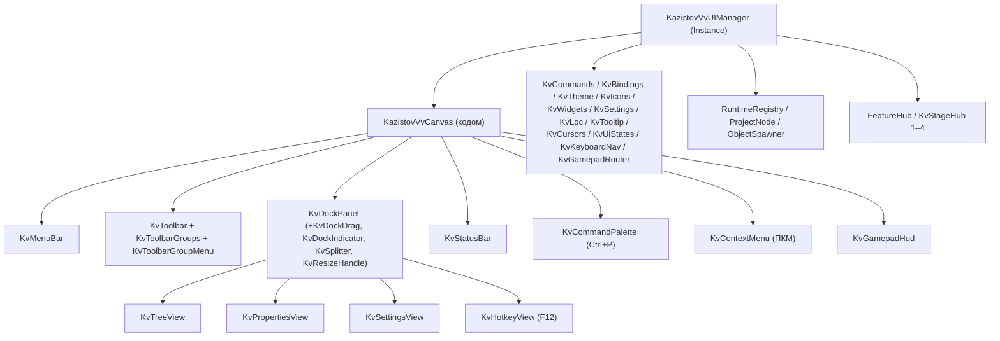

# KazistovVv — ARCHITECTURE

Архитектура платформы управления роботами KazistovVv: слои, модули, связи, точки входа,
инварианты и точки расширения. Диаграммы — текстовые (ASCII), дополнительно продублированы
mermaid-схемами.

Все имена классов, методов и файлов — из кода проекта. Там, где чего-то в проекте нет,
написано прямо: «не найдено в проекте».

---

## Оглавление

1. [Общая схема слоёв](#1-общая-схема-слоёв)
2. [Путь одного действия (сквозной сценарий)](#2-путь-одного-действия-сквозной-сценарий)
3. [Модуль интерфейса `06_KazistovVv_UI`](#3-модуль-интерфейса-06_kazistovvv_ui)
4. [Подсистема «Функции» (`01_Scripts/Features`)](#4-подсистема-функции-01_scriptsfeatures)
5. [Кто за что отвечает](#5-кто-за-что-отвечает)
6. [Как модули связаны](#6-как-модули-связаны)
7. [Инварианты, которые нельзя нарушать](#7-инварианты-которые-нельзя-нарушать)
8. [Точки расширения](#8-точки-расширения)
9. [Источники](#9-источники)

---

## 1. Общая схема слоёв

```
┌───────────────────────────────────────────────────────────────────────────────────────┐
│ 1. ВВОД                                                                               │
│   Input/{InputManager, InputProvider, KeyboardMouseInputProvider, GamepadInputProvider,│
│          VRInputProvider, MRInputProvider, KeyboardController, InputDeviceType}        │
│   Core/FreeFlyCameraController   ← оператор: WASD/QE, мышь, колесо, СКМ, два лазера     │
│   VR/{VRInputManager, VRHandTracker, PoseSelector, PlacementController, ARInputProvider}│
│   Spatial/{SpatialAnchorManager, CalibrationTool}                                      │
│   KazistovVvUI/{KvGamepadRouter, KvGamepadBridge, KvKeyboardNav, KvHotkeyView,          │
│                 KvCommandPalette, KvContextMenu, KvCursors}                             │
└───────────────────────────────────────┬───────────────────────────────────────────────┘
                                        │ UpdateAim(aimPoint, aimHit, confirmRed, confirmGreen,
                                        │   cancel, moveToggle, moveAxis, moveFast,
                                        │   aimNormal, aimOnSurface)
                                        ▼
┌───────────────────────────────────────────────────────────────────────────────────────┐
│ 2. СОСТОЯНИЕ — State Machine                                                          │
│   TrajectoryFlowController  +  SelectionState / FlowState (Trajectory/SelectionTypes)  │
│   Idle → PointSelected → TrajectoriesShown → PhantomsMoving → RobotMoving              │
│   + PointMoveMode (отдельный режим)          Esc → ResetAll → Idle                     │
└───────────────────────────────────────┬───────────────────────────────────────────────┘
                                        ▼
┌───────────────────────────────────────────────────────────────────────────────────────┐
│ 3. ПЛАНИРОВАНИЕ И ПРОВЕРКА                                                            │
│   CollisionWorld · PoseValidator · IkSolver · PostureSelector · PostureControl ·       │
│   KinematicsJacobian · Planner (BiRRT-Connect + short-cut + профиль времени) ·         │
│   ToolAlign · SafetyGate · ReachabilityOracle · PlanMetrics · NarrowPhase ·            │
│   Features/{KvConstrainedPlanner, KvToolKinematics, KvTrajMath, KvPathSmoothing,       │
│             KvTimeOptimal, KvEnergyOptimal, KvCollisionOptimizer, KvPlannerLab}        │
└───────────────────────────────────────┬───────────────────────────────────────────────┘
                                        ▼
┌───────────────────────────────────────────────────────────────────────────────────────┐
│ 4. ИСПОЛНЕНИЕ И ВИЗУАЛИЗАЦИЯ ДВИЖЕНИЯ                                                 │
│   TrajectoryExecutor · MotionExecutor · PhantomManager · LaserManager · AimIndicator · │
│   TrajectoryTube · GhostView · PointMoveHud · WorkspaceVisualizer ·                    │
│   TrajectoryMetricsPanel · Features/{KvGripper, KvPickAndPlace, KvSingularityVisualizer,│
│                              KvHeatmaps, KvForceHeat, KvCameras, KvTeachPendant}       │
└───────────────────────────────────────┬───────────────────────────────────────────────┘
                                        ▼
┌───────────────────────────────────────────────────────────────────────────────────────┐
│ 5. ПРЕДСТАВЛЕНИЕ                                                                      │
│   Features/{KvGraphics, KvOverlayKit, KvFeatureWindow, KvWorkbenchWindow, KvStartMenu, │
│             KvTutorial, KvQuickStart, KvPresentationMode, KvCinematics, KvGamepadHud}  │
│   06_KazistovVv_UI: KazistovVvUIManager + KvMenuBar / KvToolbar / KvTreeView /         │
│   KvPropertiesView / KvStatusBar / KvSettingsView / KvDockPanel / …                     │
└───────────────────────────────────────┬───────────────────────────────────────────────┘
                                        ▼
┌───────────────────────────────────────────────────────────────────────────────────────┐
│ 6. ДАННЫЕ И СЕРВИСЫ                                                                   │
│   Features/{FeatureStorage, KvSessionManager, KvActionLog, KvHealthMonitor,            │
│             KvPoseLibrary, KvZoneStore, KvUndoRedo, KvPlannerPerformance,               │
│             KvSceneManager, KvScriptEngine, KvBehaviorTree, KvRobotExport/Import}       │
│   Recording/{KvRecordingService, KvTrajectoryRecord}                                   │
│   06_KazistovVv_UI: KvLoc (локализация), KvSettings / KvLayoutStore (PlayerPrefs)       │
└───────────────────────────────────────────────────────────────────────────────────────┘
```

То же самое в mermaid:



---

## 2. Путь одного действия (сквозной сценарий)

Сценарий «оператор ставит точку и отправляет робота» проходит через все слои и хорошо показывает,
кто кого вызывает:

```
1) Камера считает прицел
   FreeFlyCameraController.ComputeAimPoint() → aimPoint, aimNormal, aimOnRealSurface
   FreeFlyCameraController.UpdateAimBallDepth() / AddScrollInput() / SnapAimBallToSurface()  ← колесо/СКМ

2) Камера отдаёт всё потоку ОДНИМ вызовом
   TrajectoryFlowController.UpdateAim(aimPoint, aimHit, confirmRed, confirmGreen, cancel,
                                      moveToggle, moveAxis, moveFast, aimNormal, aimOnSurface)

3) Поток (State Machine) решает, что это значит
   Idle + красный + ЛКМ        → LockPoint(...)  → oracleQuery(...) → PointSelected
   PointSelected               → планирование тайм-слайсами (ProcessPlanningSlices)
                                 Planner + IkSolver + PoseValidator + SafetyGate
                                 → TrajectoriesShown (8 вариантов, 8 «колбасок», 8 фантомов)
   TrajectoriesShown + зелёный + ЛКМ по «колбаске» → SelectTrajectory → PhantomsMoving
   PhantomsMoving + зелёный + ЛКМ по фантому       → SelectPhantom  → RobotMoving

4) Исполнение
   TrajectoryExecutor (план, прогресс, ETA) → MotionExecutor.Play(plan, goalQ)
   MotionExecutor ведёт робота по сэмплам (RobotController.ApplyPose / PoseValidator.ApplyToCopy)
   По завершении — FinishMotion() → Idle

5) Побочные подписчики (не влияют на переходы)
   FeatureHub.WatchFlow()  → KvUndoRedo, панель ETA, KvSpatialAudio, KvActionLog,
                             KvZoneService.CheckPlan (зоны запрета), KvPlannerPerformance
   KazistovVvUIManager     → KvStatusBar (фаза/робот/координаты), KvTreeView (точки/траектории/фантомы),
                             KvPropertiesView (метрики выбранного узла)
```

---

## 3. Модуль интерфейса `06_KazistovVv_UI`

```
                        ┌───────────────────────────────────────────────┐
                        │  KazistovVv_UI  (объект сцены)                │
                        │  KazistovVvUIManager : MonoBehaviour          │  ← KazistovVvUIManager.Instance
                        │  Awake / Start / Update / OnDestroy           │
                        │  BuildShell · RebuildShell · RegisterCommands  │
                        │  ToolbarLayout · BuildTreeModel · BuildProperties
                        │  UpdateStatusBar · Refresh · RefreshPanels     │
                        │  SelectNode · ConfirmPlacement · CommandButtonRect
                        └───────┬───────────────────────────────────────┘
                                │ строит кодом (AddComponent), сцена не меняется
        ┌───────────────────────┴────────────────────────────────────────────────┐
        │                        KazistovVvCanvas (uGUI)                          │
        │                                                                         │
        │  KvMenuBar ─────────── меню из реестра команд (MenuPath)                │
        │                                                                         │
        │  KvToolbar ─────────── из KvToolbarGroups.All → ToolbarLayout()          │
        │    ├─ KvToolbarGroupMenu  (список команд группы, свернуть группу)       │
        │    └─ KvToolbarMoreMenu   («Ещё» — не поместившиеся кнопки)              │
        │                                                                         │
        │  KvDockPanel ×N ────── пристыковываемые/открепляемые панели              │
        │    ├─ KvDockDrag        (перетаскивание за заголовок)                    │
        │    ├─ KvDockIndicator   (подсветка зоны прикрепления)                    │
        │    ├─ KvSplitter        (толщина пристыкованной панели)                  │
        │    ├─ KvResizeHandle    (8 маркеров размера плавающего окна)             │
        │    └─ KvLayoutStore     (раскладка в PlayerPrefs)                        │
        │                                                                         │
        │  Содержимое панелей (зоны):                                             │
        │    KvTreeView (KvTreeRow) · KvPropertiesView · KvStatusBar ·             │
        │    KvSettingsView (KvSettingsSchema, KvSettingsCallbacks) ·              │
        │    KvHotkeyView (F12) · KvGamepadHud · KvToolbar                        │
        │                                                                         │
        │  Всплывающие слои:                                                      │
        │    KvCommandPalette (Ctrl+P) · KvContextMenu (ПКМ по дереву) ·           │
        │    KvTooltip + KvTooltipTarget · CenterWindow (предпросмотр размещения) ·│
        │    KvSelectionHighlight (рамка выбранного объекта) · KvUiStates          │
        │    (empty / error / loading)                                            │
        └─────────────────────────────────────────────────────────────────────────┘

        ┌──────────────────────── ЯДРО (статики и сервисы) ───────────────────────┐
        │ KvTheme (+UIFactory) — палитры, тема Тёмная/Светлая/Системная, шрифты,   │
        │                        высокий контраст, схема для дальтоников, FontScale│
        │ KvIcons — процедурные монохромные иконки (24×24, штрих 1.5 px)          │
        │ KvWidgets — KvIconButton, KvSwitch, KvSegmented, строки свойств         │
        │ KvCommands — РЕЕСТР КОМАНД (кнопки, меню, палитра, подсказки)           │
        │ KvBindings — ЕДИНЫЙ РЕЕСТР БИНДОВ (окно F12 + вкладка «Управление»)     │
        │ KvSettings — PlayerPrefs (функции, масштаб, плотность, ряды тулбара)    │
        │ KvLoc (KvLocalization) — словари 7 языков, fallback, AddRuntimeStrings  │
        │ KvCursors — курсоры, KvKeyboardNav — Tab/стрелки/Enter,                 │
        │ KvGamepadRouter + KvGamepadBridge — геймпад, KvUiStates — состояния     │
        └─────────────────────────────────────────────────────────────────────────┘

        ┌─────────────────────── МОДЕЛЬ «ПРОЕКТА» (Data/) ────────────────────────┐
        │ RuntimeRegistry (Roots, RebuildFromScene, Changed)                      │
        │ ProjectNode (+ProjectNodeKind: Group/Robot/Axis/Tcp/Table/Object/Point/ │
        │              Trajectory/Phantom) · RegisteredObject (маркер в сцене)    │
        │ ObjectSpawner (копии роботов/столов по действию оператора)              │
        └─────────────────────────────────────────────────────────────────────────┘

        ┌───────────────────────── ПОДКЛЮЧАЕМЫЕ ХАБЫ ─────────────────────────────┐
        │ FeatureHub · KvStageHub · KvStageHub2 · KvStageHub3 · KvStageHub4        │
        │ (AddComponent на gameObject менеджера, регистрируются из                │
        │  KazistovVvUIManager.RegisterCommands)                                  │
        │ IdleCameraBrain — на Main Camera (автооблёт, когда оператор бездействует)│
        │ ScaraCableFollow — кабель SCARA                                          │
        └─────────────────────────────────────────────────────────────────────────┘
```



---

## 4. Подсистема «Функции» (`01_Scripts/Features`)

`Features/` — 60 файлов, namespace `KazistovVvFeatures`. Это **надстройка рядом** с ядром: она
пользуется только публичными методами потока/планировщика/валидатора и оболочки и ничего в них не
переписывает.

```
                            ┌──────────────────────────────────────────┐
                            │  FeatureHub : MonoBehaviour              │ ← FeatureHub.Instance
                            │  Ensure(manager) · Current · Update()    │
                            │  LateUpdate() (облёт в презентации)      │
                            │  BindServices · TickWorld · TickServices │
                            │  WatchFlow · HandleHotkeys · UpdateEta   │
                            │  EmergencyStop · RegisterCommands        │
                            │  BuildTreeNodes · BuildExtraProperties    │
                            │  TreeSignaturePart · LocalizeRefresh     │
                            └───┬──────────────────────────────────────┘
                                │
   ┌────────────────────────────┴──────────────────────────────────────────────────────┐
   │ ЭТАПЫ 1–20 «новых функций» (первый блок)                                           │
   │  Запись:            Recording/KvRecordingService, Recording/KvTrajectoryRecord      │
   │  Позы:              KvPoseLibrary (+KvPoseStore, KvPlanKit)                         │
   │  Суставы:           KvFeatureWindow.MakeSlider / ApplyJoint                         │
   │  Аварийный стоп:    FeatureHub.EmergencyStop                                        │
   │  Зоны запрета:      KvKeepOutZones (KvZoneData, KvZone, KvZoneService, KvZoneStore) │
   │  Сравнение:         KvComparison (+KvZoneMarks)                                     │
   │  Графики:           KvJointGraph                                                    │
   │  Тепловые карты:    KvHeatmaps (KvReachabilityHeatmap, KvClearanceOverlay)          │
   │  Гриппер/pick:      KvGripper (+KvPickAndPlace)                                     │
   │  ETA:               KvFeatureWindow.BuildEtaPanel + FeatureHub.UpdateEta            │
   │  Журнал:            KvActionLog (+KvLogEntry, уровни информация/предупреждение/ошибка)│
   │  Замер:             KvPlannerPerformance (+KvPlanRun)                               │
   │  Undo/Redo:         KvUndoRedo (+KvUndoStack, KvDelegateAction)                     │
   │  Звук/вибрация:     KvSpatialAudio, KvHaptics                                       │
   │  Сценарии:          KvScenarioManager (+KvScenario, KvScenarioStep)                 │
   │  Презентация:       KvPresentationMode                                              │
   │  Сессии:            KvSessionManager (+KvSessionStore, KvSession, KvSessionRobot)   │
   │  Окно:              KvFeatureWindow (10 вкладок, панель ETA, текст презентации)     │
   └─────────────────────────────────────────────────────────────────────────────────────┘

   ┌─────────────────────────────────────────────────────────────────────────────────────┐
   │ KvStageHub — ЭТАПЫ 1–8 (UX-сессия: фантомы, языки, экспорт, сингулярности,          │
   │                          waypoints, состояние, препятствия, пульт)                  │
   │  Экспорт демонстраций:  KvCaptures (KvCaptureService) — PNG-скриншоты, MP4 (Recorder)│
   │  Сингулярности:         KvSingularityZones (KvSingularityVisualizer)                 │
   │  Waypoints:             KvWaypoints (KvWaypoint, KvWaypointManager)                  │
   │  Health monitor:        KvHealthMonitor (+KvHealthPanel), CSV в Logs/                │
   │  Динамич. препятствия:  KvDynamicObstacles (KvDynamicObstacleService)                │
   │  Виртуальный пульт:     KvTeachPendant (+KvPendantStick)                             │
   └─────────────────────────────────────────────────────────────────────────────────────┘

   ┌─────────────────────────────────────────────────────────────────────────────────────┐
   │ KvStageHub2 — ЭТАПЫ 1–6 (главное меню, обучение, демонстрация, постобработка)       │
   │  KvStartMenu (экран запуска + кинематографический облёт)                            │
   │  KvTutorial (4 шага, автозавершение по состоянию потока, подсветка кнопки)           │
   │  KvQuickStart (6 шагов демонстрации)                                                │
   │  KvPathSmoothing (B-сплайн / Безье / Гаусс)                                         │
   │  KvTimeOptimal (перепараметризация времени, S-профиль в KvTrajMath)                  │
   │  KvEnergyOptimal (эко-профиль, 20 вариантов профиля)                                 │
   │  Инфраструктура: KvWorkbenchWindow (реестр вкладок IKvWorkbenchTab) + KvTabKit,      │
   │                  KvTrajMath, KvVariantKit, KvOverlayKit (KvMiniTip, KvHighlightFrame,│
   │                  KvHintCard, KvHoverHint), KvLocExtra                                │
   └─────────────────────────────────────────────────────────────────────────────────────┘

   ┌─────────────────────────────────────────────────────────────────────────────────────┐
   │ KvStageHub3 — ЭТАПЫ 7–12                                                             │
   │  KvWaypointConstraints (+KvWaypointLimits, KvWaypointRouteKit) — ограничения точки   │
   │  KvToolKinematics — ось инструмента, ориентационные ограничения, IK с условиями      │
   │  KvConstrainedPlanner — проверка/проекция/перепланирование под ограничение            │
   │  KvCalibration (+KvCalibrationService, KvCalibrationData) — TCP 4 точки / по нормали, │
   │                 база робота, поворот базы, камера (заглушка)                          │
   │  KvPayloadCalculator (+KvPayloadModel, KvMiniPlot) — нагрузка, кривая по расстоянию   │
   │  KvRobotExport — KUKA KRL / FANUC KAREL / ABB RAPID                                  │
   │  KvRobotImport (+KvImportedRobot, KvUrdfJoint, KvUrdfLink) — URDF / STEP              │
   │  KvLocExtra2                                                                          │
   └─────────────────────────────────────────────────────────────────────────────────────┘

   ┌─────────────────────────────────────────────────────────────────────────────────────┐
   │ KvStageHub4 — ЭТАПЫ 13–36 (производительность, показ, автоматизация, безопасность)   │
   │  KvCollisionOptimizer (+KvCollisionProxyInfo, KvCollisionBenchmark, KvCollisionTab)   │
   │  KvPlannerLab (+KvBenchTask, KvBenchResult) — стенд 3 стратегий + дерево RRT          │
   │  KvCameras (+KvCameraService, KvPiPWindow) — PiP-окна                               │
   │  KvForceHeat (+KvForceVisualizer, KvTimeHeatmap) — силы/моменты и карта времени       │
   │  KvReportPdf (+KvPdfWriter, KvReportGenerator) — PDF-отчёт вручную (без библиотек)   │
   │  KvNetTools (+KvCollaborationService, KvWebDashboard, KvCompanionServer) — UDP/HTTP   │
   │  KvXrInput (+KvVoiceService, KvHandTrackingService, KvEyeTrackingService,             │
   │              KvFoveatedRendering) — голос, руки, взгляд                                │
   │  KvAutomation (+KvScriptParser, KvScriptEngine, KvScriptMacro, KvBehaviorTree,        │
   │                KvBtRunner, KvBehaviorTreeWindow) — макросы и деревья поведения         │
   │  KvSceneStudio (+KvEnvironmentStudio, KvLightingStudio, KvMaterialStudio) — пресеты    │
   │  KvCinematics (+KvCinematicService, KvTitlesService, KvVoiceOverService) — кино/титры  │
   │  KvSafetyTools (+KvFailureSimulator, KvPreRunValidator, KvLogTools, KvFinding) —       │
   │                отказы, проверка перед пуском, уровни журнала                           │
   │  KvInputKit (поля ввода текста для вкладок), KvGraphics (страж «есть ли графика»)      │
   │  KvLocExtra3                                                                           │
   └─────────────────────────────────────────────────────────────────────────────────────┘
```

**Общий вид этапов внутри каждого хаба** (одинаковый контракт, поэтому новый этап добавляется
копированием приёма):

| Статический вход | Что делает |
|---|---|
| `Install(KazistovVvUIManager manager)` | создаёт компонент-хаб на объекте менеджера (`manager.gameObject.AddComponent<…>()`), один раз |
| `RegisterCommands(KazistovVvUIManager manager)` | регистрирует команды (кнопки + пункты меню) через `KvCommands.Register` |
| `BuildTreeNodes(manager, roots, robot)` | добавляет свои ветки в дерево моделей |
| `BuildExtraProperties(node, list)` | добавляет строки в панель свойств выбранного узла |
| `OnNodeSelected(node)` | реакция на выбор узла (обычно — открыть нужную вкладку) |
| `HasFeature(id)` / `GetFeature(id, out handled)` / `SetFeature(id, value)` | переключатели функций для панели настроек (вызываются из `ApplyVisualization`) |
| `TreeSignaturePart()` | строка-подпись содержимого дерева: по ней `KazistovVvUIManager` решает, нужно ли пересобирать дерево (оно пересобирается только при изменении) |

---

## 5. Кто за что отвечает

| Модуль | Ответственность | Ключевые классы | Файлы |
|---|---|---|---|
| Модели роботов | позы, лимиты, телеметрия, IK-исполнительные механизмы, самоколлизия | `RobotController` (+`RobotInventory`), `SixAxisController`, `SCARAController`, `RobotSelfCollision`, `RobotDH` | `Core/RobotController.cs`, `Core/SixAxisController.cs`, `Core/SCARAController.cs`, `Core/RobotSelfCollision.cs`, `Core/RobotDH.cs` |
| Оператор (камера) | обзор, движение, колесо/СКМ (глубина шарика прицела), два лазера, прицел и его нормаль, создание потока и индикатора | `FreeFlyCameraController` | `Core/FreeFlyCameraController.cs` |
| State Machine | переходы этапов 0–5, `PointMoveMode`, фиксация точки, выбор варианта и фантома, запуск движения | `TrajectoryFlowController`, `FlowState`, `SelectionState`, `TubeMath`, `PhantomMath`, `MotionTiming`, `HierarchyOrder` | `Trajectory/TrajectoryFlowController.cs`, `Trajectory/SelectionTypes.cs` |
| Кинематика и проверка позы | FK/IK, лимиты суставов, зазоры, якобиан, самозазор | `PoseValidator`, `IkSolver`, `PostureSelector`, `PostureControl`, `KinematicsJacobian`, `NarrowPhase` | `Trajectory/PoseValidator.cs`, `Trajectory/IkSolver.cs`, `Trajectory/PostureSelector.cs`, `Trajectory/PostureControl.cs`, `Trajectory/KinematicsJacobian.cs`, `Trajectory/NarrowPhase.cs` |
| Мир столкновений | капсулы звеньев, боксы сцены, «опора» (стол под роботом), фильтры служебных объектов (фантомы, лазеры, зоны, куб pick-and-place), реестр прокси | `CollisionWorld` | `Trajectory/CollisionWorld.cs` |
| Планирование | BiRRT-Connect, обход через промежуточную позу, short-cut, профиль времени, скоринг, запись дерева RRT | `Planner`, `PlannedTrajectory`, `PlanMetrics` | `Trajectory/Planner.cs`, `Trajectory/PlanMetrics.cs` |
| Безопасность плана | пороги зазора, лимитов, самозазора, сингулярностей; отказ в исполнении | `SafetyGate` | `Trajectory/SafetyGate.cs` |
| Оракул достижимости | онлайн-вердикт по точке (рабочая зона, IK, столкновения, лимиты, сингулярности), цвет шарика прицела и статуса в HUD | `ReachabilityOracle`, `AimIndicator` | `Trajectory/ReachabilityOracle.cs`, `Trajectory/AimIndicator.cs` |
| Выравнивание инструмента | доворот концевой плоскости по нормали поверхности (шаг 3, по умолчанию выключено) | `ToolAlign` | `Trajectory/ToolAlign.cs` |
| Исполнение | проход по сэмплам плана, прогресс, ETA, пауза/стоп, внешние планы | `TrajectoryExecutor`, `MotionExecutor` | `Trajectory/TrajectoryExecutor.cs`, `Trajectory/MotionExecutor.cs` |
| Лазеры, фантомы, «колбаски» | лучи рук, копии робота по каждой траектории, режимы отображения, уборка служебных объектов | `LaserManager`, `PhantomManager`, `GhostMaterial`, `PhantomOutline`, `TrajectoryTube`, `GhostView` | `Trajectory/LaserAndPhantomManagers.cs`, `Trajectory/TrajectoryTube.cs`, `Trajectory/GhostView.cs` |
| HUD и оверлеи ядра | панель режима перемещения точки с маркером, зона достижимости и лимиты, панель метрик | `PointMoveHud`, `WorkspaceVisualizer`, `TrajectoryMetricsPanel` | `Trajectory/PointMoveHud.cs`, `Trajectory/WorkspaceVisualizer.cs`, `Trajectory/TrajectoryMetricsPanel.cs` |
| Стенды | единый источник габаритов столов/ножек и постановки робота (редакторская утилита) | `StandBuilder`, `StandsMenu` | `Trajectory/StandBuilder.cs`, `Editor/StandsMenu.cs` |
| Оболочка интерфейса | сборка меню/тулбара/dock-панелей/статус-бара, реестр команд, привязка к потоку, тема, размещение объектов | `KazistovVvUIManager`, `NodeLabels`, `BoostedObjectMarker` | `06_KazistovVv_UI/03_Scripts/Core/KazistovVvUIManager.cs` |
| Реестр команд и биндов | один источник для кнопок, меню, палитры, подсказок и таблицы клавиш | `KvCommand`, `KvCommands`, `KvBindEntry`, `KvBindings` | `…/Core/KvCommands.cs`, `…/Core/KvBindings.cs` |
| Зоны интерфейса | меню, тулбар с группами, дерево, свойства, статус-бар, настройки, dock-панели, палитра, контекстное меню, F12, виртуальный геймпад | `KvMenuBar`, `KvToolbar`, `KvToolbarGroups`, `KvTreeView`+`KvTreeRow`, `KvPropertiesView`, `KvStatusBar`, `KvSettingsView`+`KvSettingsSchema`, `KvDockPanel`, `KvCommandPalette`, `KvContextMenu`, `KvHotkeyView`, `KvGamepadHud`, `KvSelectionHighlight` | `…/Zones/*.cs` |
| Ядро интерфейса | тема и палитры, иконки, виджеты, подсказки, локализация, настройки, раскладка, курсоры, состояния, навигация, геймпад | `KvTheme`+`UIFactory`, `KvIcons`, `KvWidgets`, `KvTooltip`, `KvLocalization` (`KvLoc`), `KvSettings`, `KvLayoutStore`, `KvCursors`, `KvUiStates`, `KvKeyboardNav`, `KvGamepadRouter`, `KvGamepadBridge` | `…/Core/*.cs` |
| Модель «проекта» | реестр объектов дерева, узлы, маркеры объектов в сцене, спавн копий | `RuntimeRegistry`, `RegisteredObject`, `ProjectNode`, `ProjectNodeKind`, `ObjectSpawner` | `…/Data/*.cs` |
| Функции (хаб) | сервисы, команды, дерево, свойства, горячие клавиши, аварийный стоп, ETA, Undo, звук, сценарии, сессии | `FeatureHub` | `Features/FeatureHub.cs` |
| Запись траекторий | сэмплы, файл, воспроизведение с паузой и множителем | `KvRecordingService`, `KvTrajectoryRecord` | `Recording/KvRecordingService.cs`, `Recording/KvTrajectoryRecord.cs` |
| Данные | пути и JSON-хранилище | `FeatureStorage` | `Features/FeatureStorage.cs` |
| Постобработка траекторий | метрики (jerk/ускорение/кривизна/энергия), сглаживание, время-оптимальная (S-профиль), эко-профиль, подмена плана «на месте» | `KvTrajMath`, `KvMotionLimits`, `KvEnergyModel`, `KvPathSmoothing`, `KvTimeOptimal`, `KvEnergyOptimal`, `KvVariantKit` | `Features/KvTrajMath.cs`, `KvPathSmoothing.cs`, `KvTimeOptimal.cs`, `KvEnergyOptimal.cs`, `KvVariantKit.cs` |
| Ограничения | ограничения waypoint, планирование с ограничениями, IK с условиями | `KvWaypointConstraints`, `KvWaypointLimits`, `KvWaypointRouteKit`, `KvConstrainedPlanner`, `KvToolKinematics` | `Features/KvWaypointConstraints.cs`, `KvConstrainedPlanner.cs`, `KvToolKinematics.cs` |
| Оборудование и процессы | гриппер, pick-and-place, зоны запрета, динамические препятствия, пульт | `KvGripper`, `KvPickAndPlace`, `KvZoneService`, `KvDynamicObstacleService`, `KvTeachPendant` | `Features/KvGripper.cs`, `KvKeepOutZones.cs`, `KvDynamicObstacles.cs`, `KvTeachPendant.cs` |
| Инженерия | нагрузка, калибровка, тепловые карты, сингулярности, мониторинг состояния, силы | `KvPayloadCalculator`, `KvCalibration`, `KvHeatmaps`, `KvSingularityVisualizer`, `KvHealthMonitor`, `KvForceVisualizer`, `KvTimeHeatmap` | `Features/KvPayloadCalculator.cs`, `KvCalibration.cs`, `KvHeatmaps.cs`, `KvSingularityZones.cs`, `KvHealthMonitor.cs`, `KvForceHeat.cs` |
| Экспорт/импорт | KRL/KAREL/RAPID, URDF/STEP, PDF-отчёт, скриншоты/видео | `KvRobotExport`, `KvRobotImport`, `KvReportGenerator`+`KvPdfWriter`, `KvCaptureService` | `Features/KvRobotExport.cs`, `KvRobotImport.cs`, `KvReportPdf.cs`, `KvCaptures.cs` |
| Сеть и автоматизация | UDP-мультиплеер с heartbeat, веб-дашборд, сервер команд планшета, макросы, деревья поведения | `KvCollaborationService`, `KvWebDashboard`, `KvCompanionServer`, `KvScriptEngine`, `KvBehaviorTree`, `KvBtRunner` | `Features/KvNetTools.cs`, `KvAutomation.cs` |
| XR-ввод | голос (грамматика команд), жесты рук, взгляд и фовеальное рендерирование | `KvVoiceService`, `KvHandTrackingService`, `KvEyeTrackingService`, `KvFoveatedRendering` | `Features/KvXrInput.cs` |
| Безопасность | имитация отказов, проверка перед пуском с подтверждением, уровни журнала и поиск | `KvFailureSimulator`, `KvPreRunValidator`, `KvFinding`, `KvLogTools`, `KvActionLog` | `Features/KvSafetyTools.cs`, `KvActionLog.cs` |
| VR/MR-контур (задел) | трекинг рук, выбор позы, размещение, калибровка, якоря | `VRInputManager`, `VRHandTracker`, `PoseSelector`, `PlacementController`, `SpatialAnchorManager`, `CalibrationTool`, `CollisionGuard`, `TargetMarker`, `RobotSelector` | `VR/*.cs`, `Spatial/*.cs`, `Integration/*.cs` |
| Ввод (абстракция) | единый интерфейс устройств и провайдеры | `InputManager`, `InputProvider`, `KeyboardMouseInputProvider`, `GamepadInputProvider`, `VRInputProvider`, `MRInputProvider`, `KeyboardController`, `InputDeviceType` | `Input/*.cs` |
| Редакторские утилиты | уборка «фантомных» записей, автообновление иерархии, меню стендов и интерфейса | `HierarchyPhantomCleaner`, `HierarchyAutoRefresh`, `StandsMenu`, `KazistovVvMenu`, `ConvertRobotMaterialsToHDRP` | `Editor/*.cs`, `06_KazistovVv_UI/03_Scripts/Editor/KazistovVvMenu.cs` |

---

## 6. Как модули связаны

### 6.1 Точки входа жизненного цикла

| Класс | Метод | Что происходит |
|---|---|---|
| `KazistovVvUIManager` (объект `KazistovVv_UI`) | `Awake()` | защита от дубликата (`Instance`), `EnsureEventSystem()`, `AddComponent<ObjectSpawner>()`, `KvSettings.Reload()`, `KvTheme.Reload()`, подписка на `KvTheme.Changed` |
| | `Start()` | подписка на `KvLoc.Changed` → `BuildShell()` (внутри — `RegisterCommands()` и регистрация всех хабов) → `AddComponent<KvGamepadRouter>()` → `IdleCameraBrain` на камере → `RuntimeRegistry.RebuildFromScene()` → лампа и свет → `ApplySettingsToScene()` → **`SelectNode(null)`** (никто не выбран) → `RebuildTree(true)` → `WarnAboutRobotCount()` |
| | `Update()` | горячие клавиши, выбор робота, режим размещения, активный робот для свойств; по таймерам: `statusInterval` 0.1 с → `UpdateStatusBar()` + `toolbar.Refresh()` + `menuBar.Refresh()`; `propertiesInterval` 0.2 с → свойства; `treeInterval` 0.4 с → пересборка дерева **только при изменении подписи** |
| | `OnDestroy()` | снятие подписок, `KvCommands.Clear()` |
| `FreeFlyCameraController` (на `Main Camera`) | `Awake()` | `AddComponent<AimIndicator>()` и `AddComponent<TrajectoryFlowController>()` — **точка сборки ядра потока**; синхронизация `toolOffset`/`offsetAlongNormal` с индикатором |
| | `Update()` | ввод оператора, прицел, колесо/СКМ, лазеры; **не двигает камеру** клавишами, пока `flowController.IsPointMoveMode` |
| `TrajectoryFlowController` (создаётся на камере) | `Awake()` | `AddComponent<LaserManager, PhantomManager, MotionExecutor, PointMoveHud, WorkspaceVisualizer, TrajectoryMetricsPanel>()` |
| | `UpdateAim(...)` | единственная «дверь» ввода в State Machine (перегрузки для совместимости и VR делегируют в полную) |
| | ленивая инициализация | `TrajectoryExecutor` создаётся на **объекте робота** при первой необходимости |
| `FeatureHub` (на объекте UI-менеджера) | `Update()` | `BindServices()` → `TickWorld()` → `TickServices()` → `WatchFlow()` → `HandleHotkeys()` → `UpdateEta()`; хаб сам находит `KazistovVvUIManager.Instance`, поток и камеру |
| | `LateUpdate()` | облёт камеры презентационного режима — **после** всей камерной логики кадра |
| `KvStageHub` … `KvStageHub4` (на объекте UI-менеджера) | `Install/RegisterCommands` | создаются по требованию из `KazistovVvUIManager.RegisterCommands()` |
| `SixAxisController` | `Awake()` | `AddComponent<RobotSelfCollision>()`, `RobotInventory.Guard` (проверка «роботов ровно 2») |
| `RuntimeRegistry` (статический) | `RebuildFromScene()` | собирает дерево из сцены: роботы (`RobotController`) + объекты-маркеры (`RegisteredObject`), сортировка по иерархии |

### 6.2 Статические синглтоны и глобальные реестры

| Что | Тип | Кто пишет | Кто читает |
|---|---|---|---|
| `KazistovVvUIManager.Instance` | статическое свойство | `Awake()` (с защитой от второго экземпляра) | весь UI-модуль, `FeatureHub.Update`, `KvFeatureWindow`, `ObjectSpawner` |
| `FeatureHub.Instance` / `FeatureHub.Current` | статическое свойство | `FeatureHub.Ensure(manager)` (вызывается UI-менеджером) | команды хаба, диагностика, `KazistovVvUIManager` (проверка «идёт запись»), `KvFeatureWindow` |
| `KvStageHub.Instance`, `KvStageHub2/3/4.Instance` | статические свойства | `Install(manager)` → `AddComponent` | дерево/свойства/переключатели, `KazistovVvUIManager` |
| `RuntimeRegistry` | **статический класс** (`Roots`, `Changed`, `RebuildFromScene`, `NotifyChanged`) | UI-менеджер и `ObjectSpawner` | дерево моделей, свойства, команды |
| `KvCommands` | **статический реестр** команд | UI-менеджер + все хабы | тулбар, меню, палитра, подсказки, диагностика (`KvCommands.Dump()`) |
| `KvBindings` | **статический реестр** биндов (кэш) | только чтение (`Invalidate()` — задел под переназначение) | окно F12, вкладка «Управление», проверка конфликтов |
| `KvLoc` (локализация) | статический | UI-менеджер, `KvLocExtra*`, `KvLoc.SetLanguage` | весь интерфейс, вкладки верстака, окна |
| `KvSettings`, `KvLayoutStore`, `KvTheme` | статические | UI-менеджер, панели | сборка оболочки, тема, шрифты |
| `KvActionLog.Instance` | статическое свойство | сервисы и хабы | панель журнала, вкладка уровней, выгрузка в файл |
| `KvGamepadRouter.Instance` | статическое свойство | UI-менеджер (`AddComponent`) | `FreeFlyCameraController` через `KvGamepadBridge` |
| `KvWorkbenchWindow.Instance`, `KvBehaviorTreeWindow.Instance` | статические свойства | окно создаётся при первом открытии | вкладки, команды этапов |
| `RobotInventory` | статический (`Guard`, `Suppress`) | `RobotController.Awake`, `PhantomManager.CreateGhost` | диагностический лог инвентаря роботов |
| `FeatureStorage` | статический | — | все сервисы данных |
| `TrajectoryFlowController` | **не синглтон**: живёт на `Main Camera`, ссылку раздают камера и UI-менеджер (`KazistovVvUIManager.Flow`, `FeatureHub.Flow()`) | камера | UI, хабы, свойства, диагностика |

### 6.3 Направления зависимостей (кто кого «знает»)

```
        ядро кинематики/планирования  (Trajectory/*, Core/*)
                 ▲                        ▲
                 │ не знает про интерфейс│ (только публичные read-only свойства/методы)
                 │                        │
   06_KazistovVv_UI (FreeCAD-UI) ─────────┘
        │  ▲
        │  │ FeatureHub.Ensure(manager), KvStageHub.Install(manager)
        ▼  │
     Features/* (36 этапов)  ──► читают поток/валидатор/планировщик ТОЛЬКО через публичный API
        │
        ▼
   Файлы данных (FeatureStorage → persistentDataPath / «Документы»)
```

Правила:

* **Ядро не знает об интерфейсе.** `Trajectory/*` и `Core/*` не ссылаются на `KazistovVvUI` напрямую
  (исключение — точечные «мосты»: чтение моста геймпада `KazistovVvUI.KvGamepadBridge` и проверка
  занятости Tab навигацией в `FreeFlyCameraController`, а также `KazistovVvUI.RegisteredObject`
  в `RobotInventory`). Обратная зависимость — массовая: UI и Features читают ядро.
* **Features читают ядро только публичным API.** Например `KvWaypoints` строит маршрут через
  добавленное только-для-чтения свойство `TrajectoryFlowController.Planner`, а запускает движение
  через `PlayExternalPlan` / `EndExternalMotion` / `StopExternalMotion`; `KvUndoRedo` — через
  `SelectCandidateByIndex`, `LockPointFromUi`.
* **Кросс-зависимостей «хаб → хаб» нет.** Каждый хаб регистрируется UI-менеджером независимо и
  общается с другими только через ядро (поток, валидатор, планировщик) и через общие сервисы
  (`FeatureStorage`, `KvActionLog`, `KvLoc`).
* **Порядок регистрации задан UI-менеджером:** `FeatureHub.RegisterCommands` → `KvStageHub` →
  `KvStageHub2` → `KvStageHub3` → `KvStageHub4`; при этом часть штатных команд (`edit.undo`,
  `edit.redo`) перекрывается модулем функций (из заглушек становятся рабочими).

---

## 7. Инварианты, которые нельзя нарушать

### 7.1 Из правил проекта (PROJECT_CONTEXT.md)

1. **Бинды не менять и не добавлять.** Ни один существующий бинд (`W A S D Q E`, `Z`, `X`, `G`, `F`,
   `TAB`, `Esc`, `Enter`, `Shift`, ЛКМ/колесо/СКМ) не изменяется и не дублируется. Единственное
   осознанное изменение — **Tab занят навигацией**, пока включена настройка «Навигация с
   клавиатуры» (выключается вместе с настройкой). Новые функции получают **свободные** клавиши
   (`R`, `P`, `V`, `H`, `J`, `F1–F12`, `Ctrl+Z/Y`, `Alt+…`) — перед назначением проверяется, что
   клавиша свободна.
2. **`MainScene.unity` правится МИНИМАЛЬНО и построчно.** Сцена — 6254 строки, LF, без BOM;
   каждая правка делается с проверкой ожидаемого текста строки. Роботы, столы, свет, HDRP-настройки
   и координаты не трогаются без отдельного ТЗ. Новые поля скриптов правок сцены **не требуют**:
   компоненты создаются кодом и берут значения из инициализаторов.
3. **Интерфейс строится кодом в рантайме на uGUI.** `UIDocument`/`PanelSettings`/`UXML`/`USS`
   в проект не вводить: UI Toolkit потребовал бы новых ассетов, `.meta` и правок сцены, а весь
   существующий интерфейс и оверлеи уже на uGUI.
4. **Сборки предопределённые: `Assembly-CSharp` и `Assembly-CSharp-Editor`.** В проекте **нет ни
   одного `.asmdef`** (проверено поиском) — значит весь рантайм-код попадает в `Assembly-CSharp`,
   а всё, что лежит в папках `Editor/` (`01_Scripts/Editor`, `06_KazistovVv_UI/03_Scripts/Editor`), —
   в `Assembly-CSharp-Editor`. Введение `.asmdef` меняет имена сборок и адресацию компонентов
   (`m_EditorClassIdentifier: Assembly-CSharp::…` в сцене) — это отдельная задача, а не побочный шаг.
5. **`.meta`-файлы и их GUID — часть контракта со сценой.** `.cs` переименовывается **только вместе
   с `.cs.meta`** (GUID внутри не меняется) — иначе `m_Script: {guid: …}` в сцене порвётся и
   появится «Missing (Mono Script)». Класс внутри файла обязан совпадать с именем файла. Папка
   переименовывается вместе со своим `.meta`. Файлы, созданные внешним процессом, обязаны получить
   `.meta` (иначе Unity их не импортирует и кода в сборке просто не будет).

### 7.2 Из инвариантов интерфейса (§5.22 PROJECT_CONTEXT.md)

6. **Тулбар — группы, а не поток.** Порядок и состав задаёт `KvToolbarGroups.All` (данные).
   Новая кнопка = регистрация команды + её id в группе. Неизвестные id в раскладке **игнорируются**,
   а не разложенные командой автоматически уходят в «Прочее» — ни одна команда не теряется.
   Раскладка и свёрнутые группы хранятся в `PlayerPrefs`; «Сбросить раскладку» (`ui.resetlayout`)
   чистит и то, и другое.
7. **Подсказка любой кнопки тулбара** обязана содержать НАЗВАНИЕ + ОБЛАСТЬ (группу) + описание +
   горячую клавишу; формат собирается в `KvToolbar.TooltipBodyFor`, другие места его не дублируют.
8. **Единый реестр биндов — `KvBindings.All()`.** Окно F12 и вкладка «Управление» читают только
   его (`KvSettingsSchema.Bindings()` — обёртка), поэтому таблицы не расходятся.
9. **Палитра команд ищет по всем языкам** (`KvLoc.AllLanguages`), а не только по текущему.
10. **Геймпад не влияет на клавиатуру.** Пока устройства нет — `KvGamepadBridge.Active = false`
    и флаги моста сброшены; при подключении старые «геймпадные» пути камеры (LB, левый триггер)
    отключаются, чтобы одно нажатие не срабатывало дважды.
11. **Доступность меняет палитру/шрифт через `KvTheme`**, а не подменой элементов: размер шрифта —
    `KvSettings.FontScale` в вычисляемых `FontSize*`, контраст и схема для дальтоников — в геттерах
    цветов; достаточно пересобрать оболочку (`RebuildShell`).
12. **`Refresh()` (с пересборкой дерева) — не каждый кадр.** Кадровое обновление — `RefreshPanels()`
    и таймеры 0.1/0.2/0.4 с; дерево пересобирается только при изменении подписи содержимого.
13. **Дерево:** «глазик» выключает **только рендереры** (`KvTreeView.SetObjectVisible`) — не
    `SetActive(false)`, иначе объект выпал бы из `CollisionWorld` и из расчётов. Переименование узла
    меняет **ярлык** (статический `NodeLabels` по `ProjectNode.Key`), а не имя объекта сцены:
    имена `Стенд_*`, `Стол*`, `Level`, `Plane` читают `CollisionWorld`, `KazistovVvUIManager`
    и `HierarchyPhantomCleaner`.

### 7.3 Из инвариантов поведения роботов и сцены

14. **В сцене ровно два робота, рантайм их не создаёт.** `RobotInventory.Guard` — только
    диагностика. Единственный путь появления копий — действие оператора
    (`ObjectSpawner.SpawnRobot` через «Добавить робота») или импорт модели (`KvRobotImport`).
    Автовыбора робота/узла при старте нет: `KazistovVvUIManager.Start()` → `SelectNode(null)`.
15. **Служебные объекты рантайма — только `HideFlags.HideInHierarchy`** (без `DontSave`):
    `DontSave` не даёт Unity уничтожить объект при выгрузке PlayMode-сцены, и он остаётся жить в
    редакторе «вне сцен» — это и есть «фантомная запись» в Hierarchy. Владелец объекта обязан сам
    его уничтожать (`OnDisable`/`OnDestroy`), редактор подчищает остатки
    (`HierarchyPhantomCleaner`).
16. **Служебная визуализация исключается из `CollisionWorld`.** Любой объект с `HideInHierarchy`
    перестаёт быть препятствием — это семантическая связь, которую надо учитывать при добавлении
    декора (её же сломала тележка динамического препятствия, пока её не перестали парентить под
    служебный корень). Отдельно фильтруются фантомы, лазеры, зоны запрета (`Зона_*`, `ZoneBody`)
    и куб pick-and-place (`CollisionWorld.PickAndPlaceCubeName`).
17. **Порядок этапов неизменен: точка → траектории → фантомы → движение.** Мгновенное выполнение
    по красному клику запрещено. Фантом появляется **в стартовой позе робота** и **едет** по
    выбранной траектории; мгновенный показ в конечной позе — отменён.
18. **Смещение `toolOffset` относится только к точке НА поверхности.** Для точки в свободном
    пространстве (луч ни во что не попал) смещения нет и ориентация свободная. Точки, зафиксированная
    вручную в `PointMoveMode`, при подтверждении повторно не смещается (`LockPointExact`).
19. **Колесо мыши в `PointMoveMode` игнорируется**, точка ходит только `Q/E, W/S, A/D`; в режиме
    мышь **не** двигает точку, а лазеры только индицируют.
20. **Скорость фантома — вычисляемая величина:** `robotMoveSpeed × phantomSpeedMultiplier`
    (1/15 × 3 = 1 юнит за 5 с у фантома против 1 юнита за 15 с у робота). Отдельной «скорости
    фантома» нет.
21. **Ядро (планировщик, IK, `PoseValidator`, `SafetyGate`, `CollisionWorld`, лазеры, фантомы,
    State Machine) не переписывается** ради новых функций: новое делается **снаружи**, на публичном
    API. Выравнивание инструмента `ToolAlign` выключено по умолчанию (`alignToolToSurface = false`) —
    включать только отдельным ТЗ.
22. **Никогда не удалять каталоги командой с путём из переменной без проверки.** Ошибочный
    `Remove-Item "$p\$d" -Recurse -Force` с пустой `$d` уже удалил корень проекта. Перед удалением
    проверять: переменная непустая, итоговый путь существует и оканчивается на ожидаемый каталог
    (`Temp`, `bin`, `obj`, `Library`), и держать резервную копию вне проекта.

---

## 8. Точки расширения

### 8.1 Добавить робота

| Способ | Как |
|---|---|
| **Импорт модели (штатный, без правок сцены)** | `KvRobotImport` — файл URDF/STEP кладётся в `Assets/StreamingAssets/robots` или `Документы\KazistovVv\robot_models`; импорт создаёт объект сцены и вешает на корень **штатный `SixAxisController`**, поэтому `PoseValidator` собирается по новой модели (в прогоне: 6 осей, цикл FK→IK с ошибкой 0.000 мм). Модель помечается `RegisteredObject`, поэтому проверка «роботов в сцене ровно 2» её не считает, а дерево показывает обычным узлом робота. Размещение: «отдельным объектом», «заменить робота на стенде», «добавить на стенд» (+ выбор стенда). |
| **Копия в рантайме (действие оператора)** | `ObjectSpawner.SpawnRobot` — кнопка «Добавить робота» → `KazistovVvUIManager.ConfirmPlacement`; копия получает имя `<robotName>_HHmmss` и `RegisteredObject` |
| **Вручную в сцене** | добавить prefab-instance модели (`Assets/Robots/Robot.fbx`, `Assets/Robots/ScaraRobot.fbx`) и повесить на корень `RobotController`-производный компонент (`SixAxisController`/`SCARAController`) + `RegisteredObject`; сцена правится построчно по §7.1 |
| **Стенды** | `Trajectory/StandBuilder.cs` — единый источник габаритов (столешницы, ножки, посадка робота); запуск из редактора через `Tools/Stands` (`Editor/StandsMenu.cs`), **в рантайме не вызывается** |

Куда при этом смотреть: `RuntimeRegistry.RebuildFromScene()` (дерево), `RobotInventory.Guard`
(инвентарь), `CollisionWorld.Rebuild` (робот попадает в мир как препятствие для другого робота),
`PoseValidator.Init` (лимиты, `Dof`, `BasePosition`).

### 8.2 Добавить траекторию (вариант, постобработку)

| Что добавить | Куда |
|---|---|
| **Ещё вариант в набор «8 траекторий»** | `TrajectoryFlowController`: `trajectoryCount` (1…`MaxTrajectories` = 8), `distinctAttemptCap` (бюджет попыток, сейчас 320), `detourVariants` (число разных обходов, сейчас 12), `distinctBudgetSeconds` (страховка по времени). Разные по форме пути даёт `Planner.PlanViaWaypoint` (обход через промежуточную позу); дубликаты отбрасывает `IsSamePath`. Оператору честно сообщается «уникальных N из 8», «добито похожими», «не прошли SafetyGate». |
| **Новая конфигурация IK** | `IkSolver` (`SolveAllSeeded`, `SolveAllScara`) + `PostureSelector`; добор ветвей — `TrajectoryFlowController.TopUpVariants` и `PhantomMath.PickDistinct` (сохранены как задел) |
| **Постобработка найденного пути** | `KvPathSmoothing` (B-сплайн / Безье / Гаусс), `KvTimeOptimal` (+`KvTrajMath.SProfileBuild` — аналитический S-профиль по рывку), `KvEnergyOptimal` (20 профилей, минимум энергии). Подмена плана «на месте» (фантомы в полёте видят новый путь, «колбаска» пересобирается) — `KvVariantKit.ApplyPlan` + `TrajectoryTube.Build`. |
| **Новая вкладка верстака** | `KvWorkbenchWindow.RegisterTab(IKvWorkbenchTab)` — реестр вкладок; реализация интерфейса `IKvWorkbenchTab` (готовые примеры: `KvSmoothTab`, `KvTimeOptimalTab`, `KvEnergyOptimalTab`, `KvConstrainedTab`, `KvCalibrationTab`, `KvPayloadTab`, `KvExportTab`, `KvImportTab`, `KvCollisionTab`, `KvPlannerLabTab`, `KvCameras`…). Помощник вёрстки — `KvTabKit`, поля ввода — `KvInputKit`. |
| **Ограничение на траекторию** | `KvToolKinematics` (ориентация инструмента, предел наклона, «смотреть на объект»), `KvConstrainedPlanner` (проверка по каждому сэмплу, проекция нарушающих сэмплов, «Перепланировать с ограничением»), `KvWaypointConstraints` (ограничения в точке маршрута) |

### 8.3 Добавить язык

См. `DEVELOPER_README.md` §10. Кратко: новый файл `Assets/StreamingAssets/kazistovvv_i18n/<код>.json`
формата `{ code, name, english, cjk, strings:[{key,text}] }`; каталог сканируется `KvLoc`
(`Core/KvLocalization.cs`) при старте, язык сам появляется в настройках; цепочка
«текущий язык → `en` → русский текст из кода»; выбор в `PlayerPrefs` (`KazistovVv.Language`);
смена мгновенная (`KvLoc.Changed` → `OnLanguageChanged` → `RebuildShell` + пересоздание шрифтов
+ `FeatureHub.LocalizeRefresh()`). Строки из кода (`KvLocExtra`, `KvLocExtra2`, `KvLocExtra3`)
регистрируются только при отсутствии ключа — внешние словари главнее.

### 8.4 Добавить пункт настроек

1. **Без перекомпиляции:** запись в `Assets/StreamingAssets/kazistovvv_settings.json` →
   `items[]` (`id`, `tab`, `title`, `type`, `note`). Пункт появляется на вкладке сразу.
2. **Чтобы работал:** добавить `id` в `KazistovVvUIManager.HasFeature` / `GetFeature` /
   `ApplyVisualization` (или в соответствующий `KvStageHub*.HasFeature/GetFeature/SetFeature`) —
   тогда переключатель начнёт что-то переключать. Пока обработчика нет, пункт честно показывается
   как «нет обработчика».
3. **Встроенный переключатель:** добавить id в список функций `Zones/KvSettingsView.cs` и
   обработать его в `ApplyVisualization`; состояние сохраняется в `KvSettings` (PlayerPrefs).

### 8.5 Добавить пункт меню / кнопку тулбара

1. Зарегистрировать команду: `KvCommands.Register(new KvCommand { Id, Title, Description, Hotkey,
   Icon, MenuPath = "Раздел/Подраздел/Название", Execute, IsChecked, IsEnabled, Stub })`.
   Пункт меню появляется сам из `MenuPath`; `Stub = true` даёт серую кнопку «в разработке».
2. Для кнопки на панели — добавить `Id` в нужную группу `KvToolbarGroups.cs` (`KvToolbarGroup.Commands`).
   Раскладка панели собирается из групп автоматически (`KazistovVvUIManager.ToolbarLayout()`);
   число колонок и рядов считается адаптивно (`MaxToolbarRows`, компактный режим).
3. Для иконки — использовать существующий id (`KvIcons.Has(id)`) или дорисовать новый `case`
   в `KvIcons.Draw` (примитивы `Line/Rect/Circle/Arc/Poly/Dot`, сетка 24×24, штрих 1.5 px).
4. Для новой горячей клавиши — **проверить, что она свободна**, и добавить строку в `KvBindings.All()`,
   чтобы окно F12 и вкладка «Управление» её показывали (и конфликты подсвечивались).
5. Для узла дерева и строк свойств — `KvStageHub*.BuildTreeNodes` / `BuildExtraProperties` /
   `OnNodeSelected` (у хаба есть `TreeSignaturePart()`, по которому UI понимает, что дерево
   изменилось).

### 8.6 Добавить сервис (новый модуль рядом с ядром)

1. Файл в `Assets/_Project/01_Scripts/Features/` (namespace `KazistovVvFeatures`), сервис — обычный
   класс или `MonoBehaviour` на служебном объекте с `HideFlags.HideInHierarchy`.
2. Данные — через `FeatureStorage` (JSON, `JsonUtility`): новые поля добавляются без ломки старых
   файлов, отсутствующие остаются значениями инициализаторов (`Normalize()` чинит битые файлы).
3. Регистрация в хабе: `Install(manager)` (создание компонента), `RegisterCommands`,
   `BuildTreeNodes`/`BuildExtraProperties`, `HasFeature/GetFeature/SetFeature`, при необходимости —
   `Update()` хаба для кадрового обслуживания.
4. Показ графики — через стража `KvGraphics.Available`: без графики (`-nographics`) сервис считает,
   но **не рисует**; экранные слои — через `KvOverlayKit` (свои канвасы), а не в канвас интерфейса.
5. Тексты — добавить в соответствующую таблицу `KvLocExtra*` (все 7 языков) с регистрацией только
   отсутствующих ключей.

---

## 9. Источники

Документ составлен по следующим файлам проекта:

| Файл / группа | Что взято |
|---|---|
| `PROJECT_CONTEXT.md` (3183 строки) | §2 «Архитектура», §3 «State Machine», §5 «Принятые решения», §5.21–5.22 (правила контекстного меню и инварианты интерфейса), §6 «Известные баги/риски», §8 «Отменено / не делать», §9 «Заметки по инструментам», §10 «Карта нового UI», §11–§16 (модули этапов 1–36, найденные и исправленные дефекты) |
| `Assets/_Project/01_Scripts/Trajectory/TrajectoryFlowController.cs` | состав ядра потока, `Awake` (создание `LaserManager`, `PhantomManager`, `MotionExecutor`, `PointMoveHud`, `WorkspaceVisualizer`, `TrajectoryMetricsPanel`), публичный API (`UpdateAim`, `SelectCandidateByIndex`, `LockPointFromUi`, `PlayExternalPlan`, `StopExternalMotion`, `ResetFlow`, `Planner`, `Validator`, `Executor`, `Motion`, `Phantoms`, `Lasers`, `PointHud`), значения по умолчанию (`trajectoryCount`/`phantomCount` = 8, `distinctAttemptCap` = 320, `detourVariants` = 12, `robotMoveSpeed` = 1/15, `phantomSpeedMultiplier` = 3, `toolOffset` = 0) |
| `Assets/_Project/01_Scripts/Trajectory/SelectionTypes.cs` | `FlowState`, `SelectionState`, `TubeMath`, `PhantomMath`, `MotionTiming`, `HierarchyOrder` |
| `Assets/_Project/01_Scripts/Core/FreeFlyCameraController.cs` | точка сборки ядра (`AddComponent<AimIndicator>`, `AddComponent<TrajectoryFlowController>`), ввод оператора, мост геймпада, занятость Tab |
| `Assets/_Project/01_Scripts/Core/{RobotController,SixAxisController,SCARAController,RobotDH,RobotSelfCollision}.cs` | модели роботов, `RobotInventory.Guard`, `AddComponent<RobotSelfCollision>`, namespace `KazistovVvKinematics` |
| `Assets/_Project/01_Scripts/Features/FeatureHub.cs` | `FeatureHub.Instance`, `Ensure(manager)` (создание хаба UI-менеджером), `Update`/`LateUpdate`, `BindServices`/`TickWorld`/`TickServices`/`WatchFlow`/`HandleHotkeys`/`UpdateEta`, `EmergencyStop`, `RegisterCommands`, ветки дерева и свойства |
| `Assets/_Project/01_Scripts/Features/KvStageHub.cs`, `KvStageHub2.cs`, `KvStageHub3.cs`, `KvStageHub4.cs` | контракт хаба (`Install`, `RegisterCommands`, `BuildTreeNodes`, `BuildExtraProperties`, `OnNodeSelected`, `HasFeature`, `GetFeature`, `SetFeature`, `TreeSignaturePart`) и состав этапов каждого хаба |
| остальные файлы `Assets/_Project/01_Scripts/Features/*.cs` (60 шт.) | классы и назначение сервисов (см. таблицу §5) |
| `Assets/_Project/06_KazistovVv_UI/03_Scripts/Core/KazistovVvUIManager.cs` | жизненный цикл (`Awake`/`Start`/`Update`/`OnDestroy`), `BuildShell`, `RebuildShell`, `RegisterCommands` (порядок регистрации хабов), `ToolbarLayout()`, `BuildTreeModel`, `BuildProperties`, `UpdateStatusBar`, `Refresh`, `RefreshPanels`, `SelectNode`, `ConfirmPlacement`, `OnTreeContextMenu`, `SetUiVisible`, `CommandButtonRect`, `MaxToolbarRows` |
| `Assets/_Project/06_KazistovVv_UI/03_Scripts/Core/{KvCommands,KvBindings,KvTheme,KvIcons,KvWidgets,KvTooltip,KvSettings,KvLocalization,KvLayoutStore,KvCursors,KvUiStates,KvKeyboardNav,KvGamepadRouter,KvGamepadBridge}.cs` | ядро интерфейса, реестры команд и биндов, локализация |
| `Assets/_Project/06_KazistovVv_UI/03_Scripts/Zones/*.cs` (15 шт.) | зоны интерфейса и dock-механика |
| `Assets/_Project/06_KazistovVv_UI/03_Scripts/Data/{RuntimeRegistry,ProjectNode,ObjectSpawner}.cs` | модель «проекта» и реестр объектов дерева |
| `Assets/_Project/06_KazistovVv_UI/03_Scripts/Camera/IdleCameraBrain.cs`, `Editor/KazistovVvMenu.cs` | автооблёт камеры, меню редактора `Tools/KazistovVv UI` |
| `Assets/_Project/01_Scripts/{Recording,Input,VR,Spatial,Integration,UI,Editor}/*.cs` | состав и назначение соответствующих модулей |
| `Assets/_Project/00_Scenes/MainScene.unity` (поиск по файлу) | объекты сцены и привязки скриптов (`m_EditorClassIdentifier`, `m_Namespace`) |
| `Assets/_Project/Docs/TrajectoryAlgorithmPlan.md` | исходный план алгоритма траекторий (капсульная модель, BiRRT, критерии готовности) |
| `Packages/manifest.json` | сборки/пакеты, влияющие на архитектуру (uGUI, Input System, HDRP, XRI) |
| перечень файлов `Assets/_Project/**`, `Assets/**`, `Packages/**` | отсутствие `.asmdef` и тестовых сборок, фактическая карта модулей |
